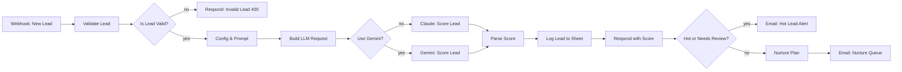

```mermaid
flowchart LR
  A[Webhook: Missed Call] --> B[Validate Missed Call] --> C{Is Payload Valid?}
  C -- no --> X[Respond: Invalid Payload 400]
  C -- yes --> D[Respond: Accepted 202] --> E[Config & Prompt] --> F[Wait 2 Minutes]
  F --> G[Build SMS Request] --> U{Use Gemini?}
  U -- no --> H[Claude: Draft SMS] --> I[Enforce SMS Rules]
  U -- yes --> H2[Gemini: Draft SMS] --> I
  I --> J[SMS Provider placeholder]
  J --> K[Email: SMS Preview] --> L[Log SMS Attempt] --> M{More Attempts Allowed?}
  M -- no --> N[Done: Max Attempts Reached]
  M -- yes --> O[Wait 1 Hour] --> P[Read Reply Flag] --> Q[Check Reply Flag] --> R{Send Follow-up?}
  R -- yes --> G
  R -- no --> S[Done: Replied or Opted Out]
```

# n8n Solar & Roofing Call Center Automations

Two importable n8n workflows for an outbound call center that books appointments for residential solar and roofing contractors:

| Workflow | File | What it does |
|---|---|---|
| AI Lead Qualification | [`workflows/ai-lead-qualification.json`](workflows/ai-lead-qualification.json) | Scores every new lead 0-100 with Claude, logs it, returns the score to the caller, alerts a closer on hot leads |
| Missed Call SMS Follow-up | [`workflows/missed-call-followup.json`](workflows/missed-call-followup.json) | Drafts a compliant follow-up text after a missed call, logs it, sends one more after an hour if there's no reply |

Stack: n8n Community Edition (self-hosted, Docker), an LLM called through the core **HTTP Request** node (no community nodes), Google Sheets, SMTP email. The LLM is **Anthropic Claude by default**, with a one-field switch to **Google Gemini** (see [Switching the LLM provider](#switching-the-llm-provider)). No paid SMS provider yet. There's a marked placeholder where one slots in.

---

## 1. AI Lead Qualification

### The business problem

Outbound centers buy or generate leads from web forms, Facebook ads and aged lists. Reps waste dials on renters, tiny electric bills and "just curious" leads, while the best leads go cold because nobody called them in the first five minutes. Qualifying by hand is slow and inconsistent between reps.

This workflow scores each lead the moment it arrives. Hot leads reach a closer immediately with a suggested opening line. Warm and cold leads go to a nurture queue. Every lead is logged, including the ones the AI couldn't score.

### Flow



### Node by node

| Node | Type | Why it's there |
|---|---|---|
| **Webhook: New Lead** | Webhook 2.1, `POST /lead-qualification`, respond via node | Dialers, form tools and ad platforms can all POST JSON. "Respond to Webhook node" mode lets us answer with the score, and only after the lead is saved. |
| **Validate Lead** | Code 2 (each item) | Real payloads are messy: `"$250/mo"`, `"yes"`, `(602) 555-0142`. Coerces types once, normalizes phone to E.164, and keeps an unknown `homeowner` as `null` instead of guessing `false`. |
| **Is Lead Valid?** | IF 2.3 | Garbage in never reaches the paid API. |
| **Respond: Invalid Lead** | Respond to Webhook 1.5, 400 | The sender gets a clear list of what's wrong and can fix it. It's not a silent 200. |
| **Config & Prompt** | Set 3.5 | **Prompt, LLM provider and model, tier thresholds, renter cap and email recipients in one place**, editable without touching code. A sales manager can change "hot = 70" here. |
| **Build LLM Request** | Code 2 (each item) | Plumbing only. Fills the prompt placeholders, wraps lead data in `<lead>` tags and strips that tag from `notes` so free text can't pose as instructions. Builds the body for the selected provider from **the same prompt text**. **Phone and email are never sent to the model** because it doesn't need them to score. An unknown `llm_provider` fails the run loudly. |
| **Use Gemini?** | IF 2.3 | `llm_provider == "gemini"` goes to Gemini. Everything else (the default `anthropic`) goes to Claude. |
| **Claude: Score Lead** | HTTP Request 4.5 → `POST https://api.anthropic.com/v1/messages` | Core node, as required. Auth uses n8n's built-in **Anthropic** credential type (it injects `x-api-key`), so no key sits in the node. Tries twice with 5s between tries (429/529 overloads happen). **On error, continue**, so the lead still flows to the parser and gets logged. 20s timeout per try: a good answer takes 1-2s, and a hung API must not hold the caller for minutes. |
| **Gemini: Score Lead** | HTTP Request 4.5 → `POST .../v1beta/models/{model}:generateContent` | Same retry, continue-on-error and timeout settings. Auth is a **Header Auth** credential sending `x-goog-api-key`. n8n's built-in Gemini credential puts the key in the URL (`?key=`), where it can leak into error messages and logs. |
| **Parse Score** | Code 2 (each item) | **One parser for both providers** (details below). Never throws. Any failure produces `scoring_status: "failed"`. |
| **Log Lead to Sheet** | Google Sheets 4.7, append | Every lead, scored or not, lands in the `Leads` tab. Cell format **RAW** so `+16025550142` stays text and a `notes` value starting with `=` isn't run as a formula. |
| **Respond with Score** | Respond to Webhook 1.5, 200 | Sent **after** the Sheet write. If Sheets is down the caller gets an error and can retry, so a lead is never acknowledged and then lost. |
| **Hot or Needs Review?** | IF 2.3, OR | `tier == hot` **or** `scoring_status == failed`. A lead the AI couldn't score goes to a human right away. Parking it in nurture could bury a hot lead. |
| **Email: Hot Lead Alert** | Send Email 2.1 | Everything a closer needs to dial now, including the suggested opener. |
| **Nurture Plan** | Set 3.5 | Readable business rule: warm = call back within 24h, cold = monthly drip. |
| **Email: Nurture Queue** | Send Email 2.1 | Hands warm and cold leads to the nurture team with the cadence. |

### How "Parse Score" handles bad model output

A `readLlmResponse` step first turns either provider's response into plain text. Everything after it is shared.

1. **HTTP failure after retries** (`$json.error`) → `failed`, with the API message in `reason`.
2. **Declined requests** (both return HTTP 200): Claude `stop_reason: "refusal"`; Gemini `promptFeedback.blockReason`, or `finishReason` of `SAFETY` / `BLOCKLIST` / `PROHIBITED_CONTENT` / `SPII` / `RECITATION` → `failed`.
3. **Thinking output is skipped.** Claude Opus 5 thinks by default, so `content[0]` may be a `thinking` block, and the parser joins every `type: "text"` block. For Gemini it joins `candidates[0].content.parts[].text`, skipping parts flagged `thought: true`.
4. **Markdown fences:** pulls the JSON out of a ```` ```json ```` block if there is one, otherwise takes the first `{` to the last `}`, so prose around it is ignored.
5. **`JSON.parse` fails** → `failed`, and the reason says "truncated" if Claude's `stop_reason` was `max_tokens` or Gemini's `finishReason` was `MAX_TOKENS`.
6. **Validates instead of trusting:** score must be numeric, is clamped to 0-100 and rounded. Renters are capped at `renter_max_score` **in code**. The **tier is derived from the score and thresholds**, so routing never depends on the model being self-consistent. The model's own tier is kept as `model_tier` for prompt tuning.

Response body:

```json
{ "score": 88, "tier": "hot", "reason": "...", "suggested_opener": "...", "scoring_status": "ok" }
```

`scoring_status` is added so the caller can tell "cold" apart from "couldn't score".

---

## 2. Missed Call SMS Follow-up

### The business problem

Most outbound dials go unanswered. A homeowner who sees a missed call from an unknown number usually won't call back, but a short text naming the company and the reason often gets a reply. Reps don't have time to text every no-answer, and texts written by hand drift out of compliance: no opt-out, emojis that break the 160-char limit, pricing claims.

This workflow texts every missed call automatically, enforces the texting rules in code, logs every attempt, and sends exactly one follow-up unless the contact replied or opted out.

### Flow



### Node by node

| Node | Type | Why it's there |
|---|---|---|
| **Webhook: Missed Call** | Webhook 2.1, `POST /missed-call` | The dialer fires this on a no-answer. |
| **Validate Missed Call** | Code 2 (each item) | Normalizes phone and validates `missed_at`. Creates `followup_id = mc-<execution id>` to tie every attempt and Sheet row to this one missed call. Maps the internal campaign code (`AZ-FB-SOLAR-Q3`) to a plain label (`solar`), so **internal codes never reach a homeowner's phone**. |
| **Is Payload Valid?** / **Respond: Invalid Payload** | IF 2.3 / Respond 1.5 (400) | The dialer learns about bad data immediately, not an hour later in a failed execution. |
| **Respond: Accepted** | Respond 1.5, **202** | Answers the dialer right away. The rest of the run takes over an hour, and nothing should hold an HTTP connection open that long. |
| **Config & Prompt** | Set 3.5 | Company name, callback number, opt-out line, 160-char limit, `max_attempts`, LLM provider and model, prompt and per-attempt guidance. All editable, no code. |
| **Wait 2 Minutes** | Wait 1.1 | Homeowners often call straight back after a missed call. Texting instantly feels robotic and can cross a callback. Waits over 65s are saved to the database, so no memory is held and it survives a restart. |
| **Build SMS Request** | Code 2 (each item) | Runs for attempt 1 and again for attempt 2 (loop). Sends only first name, service label, callback number and attempt. **No phone number, no campaign code, no timestamp** (the model can't know the contact's time zone, so it can't say "at 2pm"). |
| **Use Gemini?** | IF 2.3 | Same provider switch as workflow 1. |
| **Claude: Draft SMS** / **Gemini: Draft SMS** | HTTP Request 4.5 | Same configuration as workflow 1: no shipped credential, retries, continue on error. Gemini output is plain text (no JSON mode). |
| **Enforce SMS Rules** | Code 2 (each item) | **The prompt asks for compliance; this node guarantees it**, whichever provider wrote the draft (details below). |
| **SMS Provider (placeholder)** | No Operation | **Where Twilio / Telnyx / Vonage goes.** Marked with a red sticky note and an on-canvas note. It passes data through unchanged, so swapping it in changes nothing else. |
| **Email: SMS Preview** | Send Email 2.1 | "Send as email for now": shows exactly what would be texted, its length, and what was auto-fixed. Reads fields from **Enforce SMS Rules** by name, so it still works after the placeholder is replaced. |
| **Log SMS Attempt** | Google Sheets 4.7, append (RAW) | `SMS Log` tab: timestamp, contact, phone, campaign, attempt, message, length, source, fixes, and empty `replied` / `opted_out` columns for reps to fill. |
| **More Attempts Allowed?** | IF 2.3 | Don't wait an hour after the final attempt. |
| **Wait 1 Hour** | Wait 1.1 | Spec: one follow-up after an hour. |
| **Read Reply Flag** | Google Sheets 4.7, read, filter `phone` | Loads every logged row for this phone. **Always Output Data** is on, so zero rows still continues. |
| **Check Reply Flag** | Code 2 (all items) | `replied` counts only for **this** follow-up. `opted_out` counts on **any** row for that phone, so an opt-out from another campaign still blocks texts. Accepts TRUE / yes / checkbox. |
| **Send Follow-up?** | IF 2.3 | Loops back into **Build SMS Request** with `next_attempt: 2`. The loop reuses the same draft, enforce, send and log nodes, so the texting rules exist in one place. `max_attempts` caps it. |
| **Done: …** | No Operation | Makes each end state visible on the canvas and in the execution log. |

### What "Enforce SMS Rules" guarantees

- **One 160-character segment.** 160 is the GSM-7 limit. A single curly apostrophe or emoji switches the whole message to UCS-2, where a segment is only **70** characters and the text gets split and billed as several. The node converts smart quotes and dashes to ASCII, drops emojis and GSM-7 extension characters (`[]{}\^~|` count double), and collapses whitespace.
- **Exact opt-out line, exactly once.** Removes whatever opt-out wording the model wrote ("Text STOP to unsubscribe") and appends the configured line.
- **Sender identified.** If the company name is missing it gets prefixed.
- **Safe fallback.** On refusal or block, API error, an empty or truncated draft, or a draft that's still too long, a fixed template is used (with shorter versions for long names). `sms_source` (`llm` or `fallback_template`) and `sms_issues` record what happened.

---

## Import

**Prerequisite:** built and tested against **n8n 2.38.7**. Check your version under *Settings → About n8n*. Older 1.x instances may not have IF 2.3, Set 3.5, Google Sheets 4.7 or Respond to Webhook 1.5 (see [Verify on import](#verify-on-import)).

1. **Create the credentials** with these names **before** importing. The Email and Sheets nodes reference credentials by name with `"id": null`, and n8n links each one to the credential of that type and name on import. The LLM nodes ship with no credential, so you select one yourself in step 5.
   | Name | Type | Needed when |
   |---|---|---|
   | `Anthropic account` | Anthropic | `llm_provider` is `anthropic` (default) |
   | `Gemini API key` | Header Auth, **Name** `x-goog-api-key`, **Value** your key from [Google AI Studio](https://aistudio.google.com/apikey) | `llm_provider` is `gemini` |
   | `SMTP account` | SMTP (for Gmail use `smtp.gmail.com`, port 465, SSL, an app password) | always |
   | `Google Sheets account` | Google Sheets OAuth2 API | always |

   You only need the LLM credential for the provider you use. n8n checks the credentials of **every** node when a run starts, even nodes on a branch that never runs. A credential reference that can't be linked fails the whole run with *uses invalid credential*. That's why neither LLM node references a credential until you pick one.
2. **Create a Google Sheet** with two tabs and paste the header rows:
   - `Leads`: header row from [`sheets/Leads.csv`](sheets/Leads.csv)
   - `SMS Log`: header row from [`sheets/SMS Log.csv`](sheets/SMS%20Log.csv)
3. **Import** each file: *Workflows → Create → ⋯ → Import from File*. Or with the CLI:
   ```bash
   docker cp workflows n8n:/tmp/workflows
   docker exec n8n n8n import:workflow --separate --input=/tmp/workflows
   ```
4. **Paste your spreadsheet ID** (the long id in the Sheet URL) into **Log Lead to Sheet**, **Log SMS Attempt** and **Read Reply Flag**, replacing `REPLACE_WITH_YOUR_SPREADSHEET_ID`.
5. **Select the LLM credential** for your provider: open **Claude: Score Lead** / **Claude: Draft SMS** and pick `Anthropic account`, or **Gemini: Score Lead** / **Gemini: Draft SMS** and pick `Gemini API key`. Leave the other provider's nodes without a credential.
6. **Edit `Config & Prompt`** in each workflow: company name, callback number, recipient emails.
7. **Publish** each workflow to enable its production webhook URL.

## Switching the LLM provider

Both workflows read the same fields in **Config & Prompt**:

| Field | Default | Notes |
|---|---|---|
| `llm_provider` | `anthropic` | `anthropic` or `gemini`. Any other value fails the run with a clear error instead of silently picking one. |
| `anthropic_model` | `claude-opus-5` | |
| `anthropic_effort` | `low` | `output_config.effort`: `low` / `medium` / `high` / `xhigh` / `max` |
| `gemini_model` | `gemini-3.5-flash` | Stable, and free of charge on Gemini's free tier at the time of writing |
| `gemini_thinking_level` | `low` | `generationConfig.thinkingConfig.thinkingLevel` |
| `max_tokens` | 8000 / 4000 | Sent as `max_tokens` or `maxOutputTokens`. **Both providers count thinking tokens against it**, so keep it generous. |

To switch, set `llm_provider` to `gemini` in **Config & Prompt**, create the `Gemini API key` credential, and select it in **Gemini: Score Lead** / **Gemini: Draft SMS**. If you had already selected `Anthropic account` in the **Claude:** nodes, you can leave it; a linked credential that never runs doesn't block anything.

**What stays the same:** the system prompts (`prompts/*.txt`), the lead data sent, the JSON output contract (`score`, `tier`, `reason`, `suggested_opener`), the parser, the SMS enforcement and every downstream node.

**What differs:**

| | Anthropic | Gemini |
|---|---|---|
| Endpoint | `POST /v1/messages` | `POST /v1beta/models/{model}:generateContent` |
| Auth | Anthropic credential (`x-api-key`) | Header Auth credential (`x-goog-api-key`) |
| Prompt fields | `system`, `messages` | `systemInstruction`, `contents` |
| JSON help | Prompt only | Prompt plus `responseMimeType: application/json` (lead scoring only) |
| Refusal fallback | `fallbacks: "default"` (beta header) | None; a block becomes `failed` / the SMS template |
| Sampling | Defaults | Defaults (Google recommends not changing temperature on Gemini 3) |

> **Before using Gemini's free tier with real leads:** Google's pricing page says free-tier content is **"Used to improve our products: Yes"** (paid tier: No). The lead workflow sends names, addresses and notes, though never phone or email. Use synthetic leads on the free tier, or turn on billing for real homeowner data. Free-tier rate limits are low and change; see your limits in [AI Studio](https://aistudio.google.com/rate-limit). A burst of leads will hit 429s, which the retries soften but don't remove.

## Test

Sample payloads are in [`samples/`](samples). Every curl command is in [`samples/test-webhooks.sh`](samples/test-webhooks.sh).

Use the **production** URL (`/webhook/...`, workflow published). The **test** URL (`/webhook-test/...`) only accepts one request each time you click *Execute workflow*.

```bash
# Workflow 1: expect 200 with a score object
curl -s -X POST http://localhost:5678/webhook/lead-qualification \
  -H "Content-Type: application/json" --data @samples/lead-hot.json

curl -s -X POST http://localhost:5678/webhook/lead-qualification \
  -H "Content-Type: application/json" --data @samples/lead-warm.json

# Renter whose notes try a prompt injection: expect score <= 15, tier "cold"
curl -s -X POST http://localhost:5678/webhook/lead-qualification \
  -H "Content-Type: application/json" --data @samples/lead-cold-renter.json

# Expect 400 with validation details
curl -s -i -X POST http://localhost:5678/webhook/lead-qualification \
  -H "Content-Type: application/json" --data @samples/lead-invalid.json

# Workflow 2: expect 202 {"status":"accepted","followup_id":"mc-..."}
curl -s -X POST http://localhost:5678/webhook/missed-call \
  -H "Content-Type: application/json" --data @samples/missed-call.json
```

On Windows PowerShell, call `curl.exe` explicitly (plain `curl` is an alias for `Invoke-WebRequest`). The `--data @file` form avoids JSON quoting problems.

**Workflow 2 without waiting an hour:** temporarily set **Wait 2 Minutes** to 10 seconds and **Wait 1 Hour** to 20 seconds. Send the missed call and you'll get two `[SMS PREVIEW]` emails. Send it again and, between the two emails, type `TRUE` in the `replied` cell of the new row. Only attempt 1 will arrive.

### Checks in this repo

```bash
npm run check   # rebuild JSON, validate it, run 43 unit tests (Node 20+, no dependencies)
```

- `scripts/validate-workflows.mjs` checks the required top-level keys, the workflow id (the CLI import fails without one), unique UUID node ids and names, node type/typeVersion against n8n 2.38.7, webhookIds, no overlapping nodes, no unconnected nodes, name-only credentials, no credentials on the LLM request nodes, **every `$('Node Name')` reference pointing at a real node** (catches renames), and secret patterns.
- `test/code-nodes.test.mjs` runs the JavaScript **from the built workflow JSON** against both providers' response shapes: fences, thinking blocks and thought parts, prose-wrapped JSON, refusals and blocks, HTTP errors, truncation, renter caps, emojis, smart quotes, over-length drafts, long names and reply/opt-out flags.

### What was verified end to end

Before publishing, both workflows were run in a throwaway `n8nio/n8n:2.38.7` container:
- The shipped JSON imported through the CLI, and the name-only credentials were auto-linked.
- On a real n8n 2.38.7 instance with only a Gemini key, the earlier build (both LLM nodes referencing a credential by name) failed every run with *Node "Claude: Score Lead" uses invalid credential*. After removing the LLM credential references and selecting `Gemini API key` in the Gemini nodes, the samples ran against real Gemini: hot 98 / `hot`, renter 5 / `cold`, invalid 400.
- Copies were published, with the Anthropic URL pointed at a local mock API, SMTP at Mailpit, Waits shortened (the 2-minute wait was kept above 65s so the database-saved wait path ran), and the three Google Sheets nodes replaced by pass-through Code nodes (no Google account offline).

23/23 checks passed:
- Hot, warm and renter leads returned the right tiers.
- Invalid payloads returned 400.
- Non-JSON output, refusal, and an HTTP 529 (retried 3 times) all returned `failed` and emailed a human.
- Requests carried `x-api-key` from the credential plus the version and beta headers, and contained no phone or email.
- The missed-call flow sent attempt 1 after the wait, looped to attempt 2, and stopped after attempt 1 for a contact marked `replied`. Every SMS was ≤160 plain ASCII with one opt-out line.

---

## Verify on import

These are the parts that could **not** be proven offline:

1. **n8n version.** Node versions match n8n 2.38.7. On an older instance, nodes may import as unrecognized or with missing parameters. Upgrade, or re-add the affected node at the version your instance offers.
2. **Google Sheets nodes never ran against a real Sheet.** Their parameters were checked against the 2.38.7 node schema, but confirm after pasting the spreadsheet ID:
   - both tabs are named exactly `Leads` and `SMS Log`
   - the column mapping in the append nodes shows every column (click *Refresh columns* if not)
   - **Read Reply Flag**'s filter column shows `phone`
3. **`fallbacks: "default"` and the `anthropic-beta: server-side-fallback-2026-07-01` header were only exercised against the mock.** If the real API returns a 400 about `fallbacks`, the parser marks leads `failed` with that message. Then delete `fallbacks: 'default'` in **Build Claude Request** / **Build SMS Request** and the `anthropic-beta` header in both **Claude:** nodes.
4. **Real model output quality.** The mock proved the plumbing, not the scoring. Run the samples with your real key and read the scores, reasons and SMS drafts.
5. **Credential auto-linking** only happens when exactly one credential of that type has that exact name. Otherwise open each **Email:** and **Sheets** node and select the credential. The **Claude:** / **Gemini:** nodes always need a manual pick (import step 5).
6. **Anthropic credential in HTTP Request.** Confirmed from the n8n source (the credential picker accepts any type with `authenticate`) and in the e2e run, but if your instance doesn't list *Anthropic* under *Predefined Credential Type*, switch to *Generic Credential Type → Header Auth* with header `x-api-key`.
7. **Gemini request details.** The endpoint, `x-goog-api-key` header, `thinkingConfig.thinkingLevel` and `responseMimeType` follow Google's current docs, and parsing of thought parts and `finishReason` is unit-tested. Google's pages disagree on whether REST wants `low` or `LOW`, so if Gemini returns a 400 mentioning `thinkingLevel`, change `gemini_thinking_level` to `LOW`.

---

## Telemetry (optional)

Both workflows can report each run to an HTTP collector: which model answered, how many tokens it
burned, how long the call took, and - when the model failed - which node to look at. It is off
until you set `telemetry_url` in **Config & Prompt**.

```
Config & Prompt -> telemetry_url: http://llmobs:9109/v1/events
```

The event is built by a Code node (`Telemetry: Report Run` / `Telemetry: Report Attempt`) and
posted by the HTTP node after it. Both sit **after** the caller has been answered and the row has
been written, and the HTTP node continues on error, so telemetry can never delay a response or
fail a lead.

The receiving end I run is [`llmobs`](https://github.com/Nabil-Sehli/oracle-ops-platform), but the
payload is plain JSON and any endpoint can take it:

```json
{
  "run_id": "n8n-4711",
  "workflow": "AI Lead Qualification",
  "status": "ok",
  "duration_ms": 2310,
  "steps": [
    { "node": "Validate Lead", "status": "ok" },
    { "node": "Gemini: Score Lead", "status": "ok", "provider": "gemini",
      "model": "gemini-3.5-flash-lite", "tokens_in": 812, "tokens_out": 96, "duration_ms": 1700 },
    { "node": "Log Lead to Sheet", "status": "ok" }
  ],
  "attrs": { "tier": "hot", "score": 95, "scoring_status": "ok" }
}
```

Three details that are easy to get wrong:

- **Gemini bills thinking tokens as output** and reports them in a separate `thoughtsTokenCount`;
  Anthropic already folds them into `output_tokens`. The builders normalize both to one number, so
  a provider switch doesn't quietly change what "output tokens" means.
- **A lead the model couldn't score is `partial`, not `failed`.** The pipeline worked: the lead was
  logged, the caller was answered, a human was emailed. Only the model let go. Counting it as a
  pipeline failure would hide real breakage behind API weather.
- **The follow-up workflow puts the attempt number in `run_id`.** Attempt 2 runs an hour later
  inside the *same* n8n execution, so without it a collector that dedupes by run id would treat the
  second attempt as a retry and drop its tokens and cost on the floor.
- **The telemetry node sits above the branch it shares a parent with.** `executionOrder: v1` runs
  sibling branches by node *position*, top to bottom - not by connection order - and the other
  branch runs into `Wait 1 Hour`. A Wait node suspends the whole execution and saves every branch
  that hasn't run along with it, so a telemetry node placed lower on the canvas reports the
  attempt an hour late. In the saved execution that is indistinguishable from "ran and returned
  nothing" until you look at `nodeExecutionStack`.

After importing, link a **Header Auth** credential (a token header your collector expects) on the
`Telemetry: Post ...` node. Like the LLM nodes, it ships without a credential reference on purpose:
n8n validates every node's credentials when a run starts, so a dangling reference would fail runs
for anyone who never set up a collector.

## Design choices worth knowing

- **Provider switch in config, not in code paths.** One field picks the LLM. The prompt, output contract and parser are shared, so switching providers changes cost and quality, not behavior.
- **Model:** `claude-opus-5` with `effort: "low"` by default. Scoring and a 160-char draft are short tasks, and low effort is the main latency and cost lever. `max_tokens` covers thinking **plus** the answer, which is why it's 8000/4000 rather than a few hundred. It's a ceiling, not what you pay for. Change the model or effort in **Config & Prompt**. Measure a cheaper model against the eval set below before switching.
- **Hard rules in code, judgment in the model.** Tier thresholds, the renter cap, SMS length, opt-out wording and sender ID are deterministic. Claude does what code can't: reading notes and writing natural copy.
- **Log before acknowledging.** A 200 means the lead is saved.
- **Failures go to people, not to `/dev/null`.** An API outage turns into manual-review emails, not dropped leads.
- **Worst-case latency:** 2 tries of up to 20s with a 5s gap, so the lead webhook answers within ~45s even when the API hangs (it then logs the lead for manual review). With the earlier 3 × 120s settings a hanging Gemini held one run for 259s. Set the caller's timeout to at least 60s.

## What I'd add next

1. **Webhook auth and idempotency.** Header auth on both webhooks (they're open now for easy testing and they spend API credits). Dedupe on `phone + missed_at` so a dialer retry doesn't text twice.
2. **Error Workflow.** An *Error Trigger* workflow that reports any failed execution (for example SMTP or Sheets down after the webhook responded). The [ops-platform](https://github.com/Nabil-Sehli/oracle-ops-platform) repo has one that posts to the same collector as the telemetry above, so failures and successes land in one place.
3. **Structured outputs.** Add `output_config.format` with a JSON schema so the API itself guarantees the score shape. Keep the parser as a second line of defense.
4. **Texting compliance gates before the SMS provider goes live** (confirm specifics with counsel): documented consent for each number, a quiet-hours check in the recipient's local time (from area code or address), a DNC scrub, and 10DLC registration with the provider.
5. **Inbound SMS workflow.** The provider's inbound webhook sets `replied` / `opted_out` in the Sheet automatically and handles STOP / HELP keywords, replacing manual flags.
6. **CRM instead of Sheets** (GoHighLevel, HubSpot, or Postgres) once volume grows. Sheets has API rate limits and no real concurrency control.
7. **Eval set and threshold tuning.** Label a few hundred historical leads by outcome (booked or not), measure score against outcome, tune `hot_threshold`, sweep effort levels, and track cost per booked appointment from the API `usage` fields.
8. **Nurture digest.** One daily email or task list instead of one email per warm or cold lead.

## Repo layout

```
workflows/            importable n8n JSON (generated, committed)
code-nodes/           the exact JavaScript inside each Code node
prompts/              system prompts (copied into the Set nodes at build)
scripts/              build-workflows.mjs, validate-workflows.mjs
test/                 unit tests for the Code nodes
samples/              webhook payloads + curl script
sheets/               header rows for the two Google Sheet tabs
```

Small edits in the n8n editor are fine. If you change Code-node logic or a prompt, edit the files here and run `npm run check`, so the tests cover what you ship.
